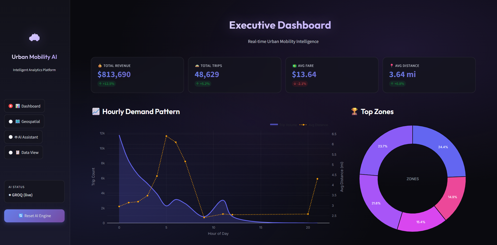
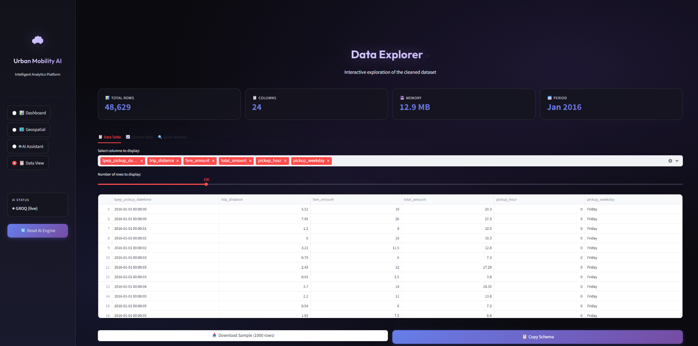
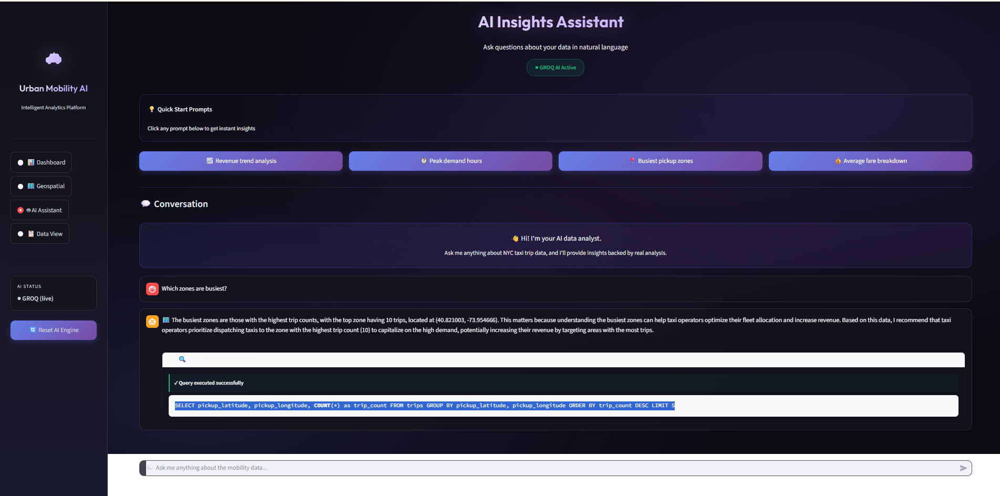
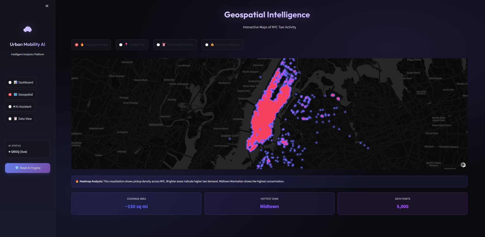
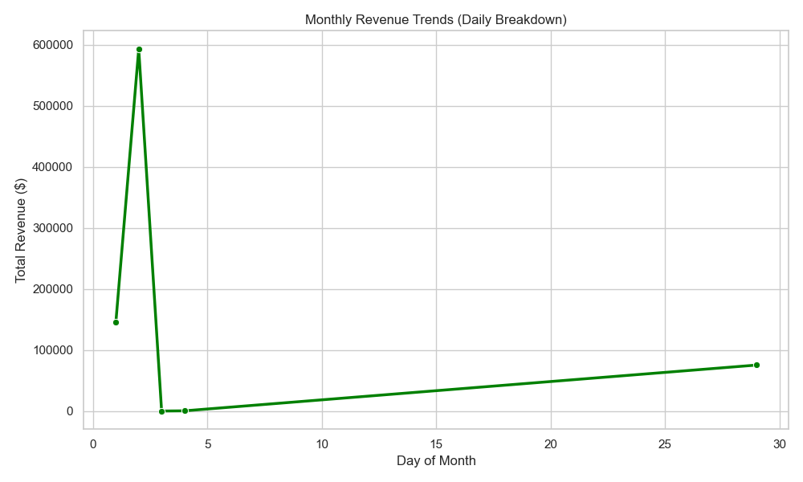
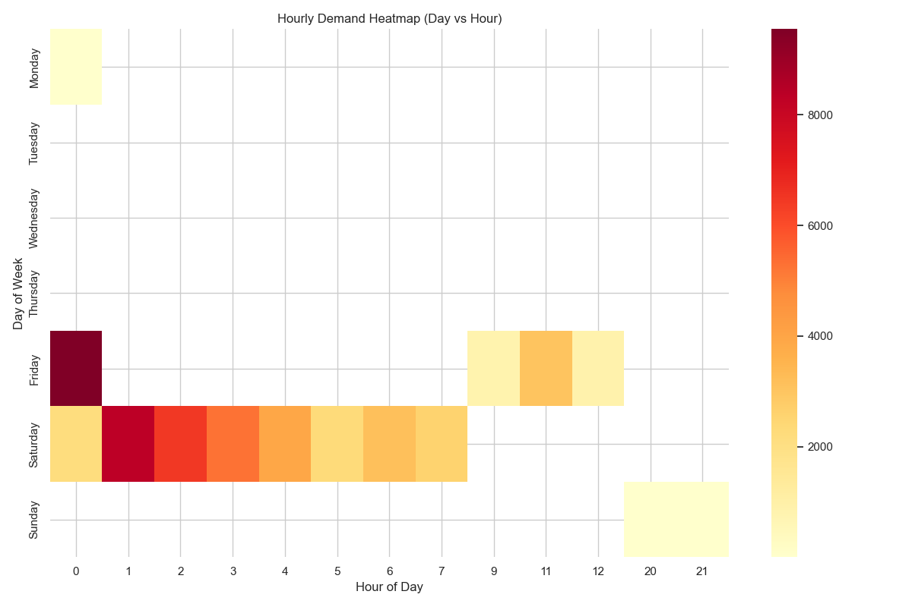
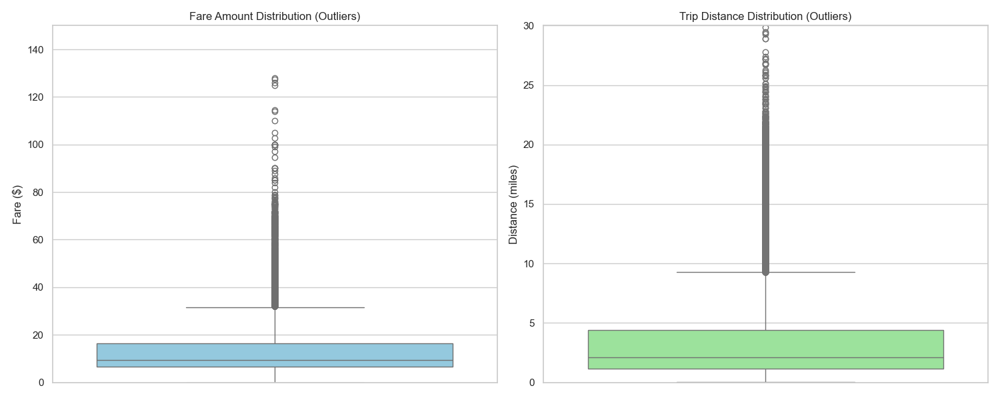
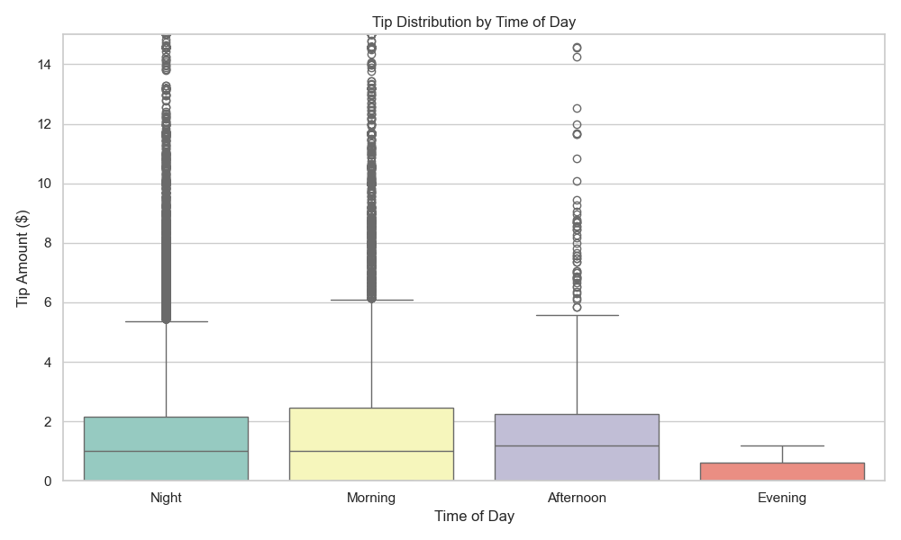

# 📘 Technical Documentation
## Urban Mobility Analytics & GenAI Platform

This document provides a deep dive into the technical architecture, code structure, and data flows of the platform.

---

## 🏗️ 1. Architecture Overview

The application follows a **modular 3-tier architecture**:

1.  **Presentation Layer**: Streamlit UI (`app.py`) for interactive dashboards and chat interface.
2.  **Logic Layer**: Python Classes for Data Analysis (`MobilityDataAnalyzer`) and AI Logic (`GenAIAssistant`).
3.  **Data Layer**: SQLite Database managed by `MobilityDBManager` for structured querying and persistence.

**Data Flow:**
`CSV (Raw)` -> `Pandas Clean/Transform` -> `SQLite Database` -> `SQL Query` -> `Visualization / AI Insight`

---

## 🧩 2. Module Breakdown

### `code/app.py`
The main entry point. It handles:
-   **State Management**: Caching heavy data loading using `@st.cache_resource`.
-   **UI Layout**: Sidebar navigation, dashboard grid, and chart rendering using Plotly.
-   **Interaction**: capturing user inputs (chat, sliders, map selections).

### `code/mobility_analytics.py`
Contains the `MobilityDataAnalyzer` class responsible for ETL (Extract, Transform, Load) in memory:
-   **`load_data(nrows)`**: Optimizes memory by specifying `dtypes` (e.g., `float32`, `int8`).
-   **`clean_data()`**: Filters invalid coordinates (outside NYC), zero fares, or negative values.
-   **`feature_engineering()`**: Derives new columns like `pickup_hour`, `trip_duration_min`, and `pickup_weekday`.

### `code/database_manager.py`
Contains the `MobilityDBManager` class for SQLite interactions:
-   **`ingest_data(analyzer)`**: Writes the cleaned Pandas DataFrame to a SQL table `trips`.
-   **`run_query(query)`**: Executes raw SQL and returns a DataFrame. safe handling for multiple threads.
-   **Pre-canned Queries**: Methods like `get_hourly_demand()` and `get_revenue_trends()` for fast dashboard loading.

### `code/genai_assistant.py`
The brain of the platform. It abstracts the LLM provider:
-   **Provider Agnostic**: Supports **Groq**, **OpenAI**, and **DeepSeek**.
-   **`text_to_sql(query)`**: Uses a system prompt with the exact Database Schema to convert natural language to SQL.
-   **`generate_insight(context, prompt)`**: Takes the SQL result and User Question to generate a business-friendly narrative.

### `code/spark_etl.py`
A standalone script for **Big Data** processing:
-   Uses **PySpark** instead of Pandas.
-   Designed for datasets larger than RAM (e.g., full year data ~100GB).
-   Outputs partitioned Parquet files for efficient querying.

---

## 🗄️ 3. Database Schema

The system uses a single denormalized table `trips` for performance in analytics queries.

| Column | Type | Description |
| :--- | :--- | :--- |
| `tpep_pickup_datetime` | DATETIME | Trip start time |
| `tpep_dropoff_datetime` | DATETIME | Trip end time |
| `passenger_count` | INTEGER | Number of passengers |
| `trip_distance` | FLOAT | Distance in miles |
| `pickup_longitude` | FLOAT | Start Longitude |
| `pickup_latitude` | FLOAT | Start Latitude |
| `dropoff_longitude` | FLOAT | End Longitude |
| `dropoff_latitude` | FLOAT | End Latitude |
| `fare_amount` | FLOAT | Meter fare |
| `tip_amount` | FLOAT | Tip amount |
| `total_amount` | FLOAT | Total charged (Fare + Tax + Tip) |
| `pickup_hour` | INTEGER | Derived: Hour (0-23) |
| `pickup_day` | INTEGER | Derived: Day of month |
| `pickup_weekday` | TEXT | Derived: Day name |

---

## 🤖 4. AI Logic & Prompt Engineering

The AI Assistant uses a **RAG-lite (Retrieval Augmented Generation)** approach:

1.  **User asks**: *"Show me the busiest areas."*
2.  **step 1 (SQL Gen)**: System prompt includes table schema. LLM outputs:
    `SELECT pickup_latitude, pickup_longitude, COUNT(*) FROM trips GROUP BY 1, 2 LIMIT 10`
3.  **Step 2 (Execution)**: `database_manager` runs query -> gets DataFrame.
4.  **Step 3 (Insight Gen)**: Data + User Question -> LLM.
    *"The data shows Midtown (lat/lon...) is top with 5000 trips."*

**Prompt Strategy:**
-   **Role Persuasion**: "You are an expert SQL analyst..."
-   **Context Injection**: Schema definitions given in system prompt.
-   **Constraints**: "Return ONLY SQL", "Use SQLite syntax".

---

## ⚡ 5. Performance & Scalability

-   **Memory Optimization**: Using `float32` halves memory usage compared to default `float64`.
-   **Caching**: Streamlit's cache prevents reloading data on every interaction.
-   **SQL Indexing**: (Future Improvement) Adding indices on `pickup_datetime` and `pickup_location` would speed up filtering.
-   **Big Data Path**: For >10GB files, use `spark_etl.py` to pre-aggregate data into daily summaries before loading into the dashboard.

---

## 🖼️ 6. Gallery & Deliverables

### UI Demo Video

*(Click image to watch video if validated by viewer, or open file directly)*

### UI Screenshots
| Landing Page | Data View |
| :---: | :---: |
|  |  |

| AI Assistance | Geospatial View |
| :---: | :---: |
|  |  |

### Analytical Deliverables
#### Revenue Trends

#### Hourly Demand Heatmap

#### Outliers Analysis

#### Tip Distribution

### Key Reports
- [KPI Report](screenshot/deliverables/kpi_report.txt)
- [SQL Execution Results](screenshot/deliverables/sql_results.txt)
