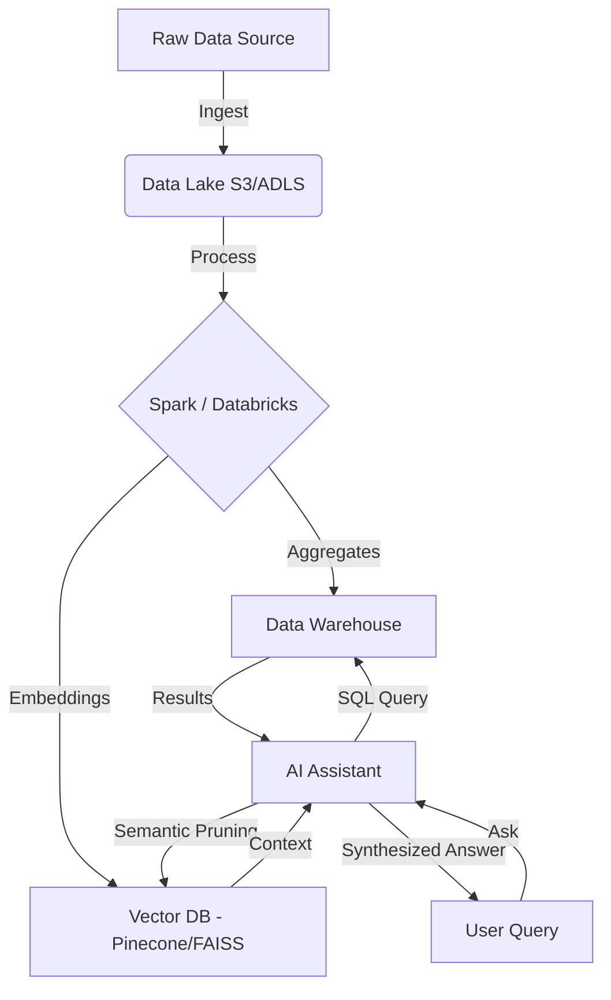

# 🚀 Scalability Strategy (100GB+ Data)

This document outlines the architecture for scaling the Urban Mobility Analytics platform to handle large-scale datasets (100GB+).

## 🏗️ Architecture Overview

For production-grade deployments handling massive datasets, we transition from local processing to a distributed cloud-native architecture.

### 1. Storage Layer
**Technology:** Amazon S3 / Azure Data Lake Storage (ADLS)
- **Format:** Parquet (Columnar storage, Snappy compression)
- **Partitioning:** Partitioned by `year/month/day` to optimize query performance.
- **Benifit:** Decouples compute from storage, allowing cost-effective long-term retention.

### 2. Processing Layer
**Technology:** Apache Spark / Databricks
- **ETL:** Distributed Spark jobs to clean, transform, and aggregate raw trip data.
- **Compute:** Auto-scaling clusters to handle heavy aggregations (e.g., "Average fare by zone for last 5 years").
- **Output:** Aggregated views stored back to Data Lake or loaded into a high-performance Data Warehouse (Snowflake/BigQuery).

### 3. Indexing Layer (Vector Search)
**Technology:** Vector Database (FAISS / Pinecone / Milvus)
- **Embedding:** Generate vector embeddings for:
    - **Zone Descriptions:** Textual description of zones to allow semantic search (e.g., "Find busy commercial areas").
    - **Trip Patterns:** Vectorize hourly demand patterns to find "similar days" or "anomalous events".
- **Usage:** Enables fast semantic retrieval for the AI Assistant.

### 4. Retrieval (RAG & GenAI)
**Technology:** RAG (Retrieval-Augmented Generation) over Aggregated Metrics
- **Flow:**
    1. **User Query:** "Why was demand high in Midtown last Tuesday?"
    2. **Retrieval:** System fetches relevant aggregated metrics (SQL) and similar historical contexts (Vector DB).
    3. **Augmentation:** Prompts the LLM (Groq/Llama3) with precise data context.
    4. **Generation:** AI explains insights backed by hard numbers.

## 🔄 Data Pipeline Flow

